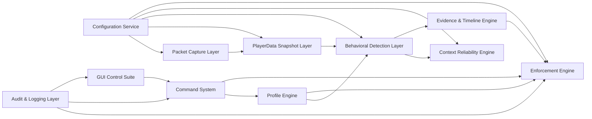

# Judexis AntiCheat — Professional Rebuild

## Product
- Name: Judexis AntiCheat
- Engine: Judexis Core
- Version: 5.0-BetaTest
- Edition: Commercial Edition

## Refactored Architecture Diagram

## Layer Contracts
1. Packet Capture (`PacketCaptureLayer`, `ProtocolLibPacketCapture`)
2. Snapshot Layer (`PlayerDataSnapshotLayer`, `PlayerDataRepository`)
3. Behavioral Layer (`BehavioralDetectionLayer`, `BehavioralDetectionManager`)
4. Context Layer (`ContextReliabilityEngine`, `DefaultContextReliabilityEngine`)
5. Evidence Layer (`EvidenceEngine`, `EvidenceManager`)
6. Enforcement (`EnforcementEngine`, `DefaultEnforcementManager`)
7. Profile (`ProfileEngine`, `ProfileManager`)
8. Audit (`AuditLayer`, `FileAuditLogger`)
9. GUI (`GuiControlSuite`, `GuiController`)
10. Commands (`CommandSystem`, `JudexisCommandSystem`)
11. Configuration (`ConfigurationService`, `BukkitConfigurationService`)

## Behavioral Engine Rebuild
- `BehavioralModule` rebuilt with mandatory fields:
	- `suspicion`
	- `threshold`
	- `anomalyCounter`
	- `requiredAnomalies`
	- `lastTickProcessed`
	- `cooldownTicks`
- Decay is tick-based only.
- Module flow is anomaly accumulation-based and context-scaled.
- Modules never modify phase and never enforce directly.

## 39 Individual Modules
- Combat (12): `KillAuraEntropy`, `KillAuraGcdSnap`, `KillAuraMicroCorrection`, `KillAuraTargetSwitch`, `ReachRaytrace`, `AutoClickerInterval`, `SilentAimFovMismatch`, `TriggerBotReaction`, `NoKnockbackSimulation`, `VelocityReductionCluster`, `WTapMacroPattern`, `CombatAimDistribution`
- Movement (11): `SpeedFriction`, `FlyGravity`, `GlideLowGravity`, `NoFallGroundSpoof`, `JesusLiquidWalk`, `StrafeAngleCv`, `SprintModifierDrift`, `PotionSpeedAnomaly`, `AirAcceleration`, `StepPattern`, `MovementTimerDesync`
- World (10): `ScaffoldAngleConsistency`, `ScaffoldIntervalUniformity`, `ScaffoldBackwardPlacement`, `FastBreakHardness`, `NukerBurst`, `GhostHandDistance`, `PhaseAabbCollision`, `BlockReachWorld`, `InvalidInteractVector`, `WorldOrderAnomaly`
- Packet (6): `TimerPpsSustain`, `BlinkBurst`, `PingSpoofRtt`, `RotationPacketGcd`, `RotationPacketRepeatDelta`, `PacketOrderSequence`

## Evidence and Phase System
- Evidence records include:
	- timestamp
	- module
	- suspicion delta
	- reliability
	- phase at time
	- tick
- Phase transitions are centralized in `EvidenceManager` only:
	1. Monitoring
	2. Suspicion Escalated
	3. Critical
	4. Enforcement Authorized

## Context Reliability
- Reliability range enforced: `0.0` to `1.0`
- Inputs:
	- teleport grace
	- velocity grace
	- join grace
	- low TPS
	- high ping
	- packet irregularity
- Effective suspicion:
	- `effectiveSuspicion = baseSuspicion * reliability`

## Enforcement Integration
- `DefaultEnforcementManager` handles:
	- freeze
	- unfreeze
	- enforcement toggle
	- panic mode respect
	- maintenance mode respect
- GUI does not mutate detection state.

## Performance Safeguards
- No per-packet object allocation in `analyze()` methods.
- No Stream API in hot path.
- No reflection in detection loop.
- No synchronized blocks in packet thread.
- O(1) fixed-buffer operations.
- Primitive circular buffers with preallocated percentile scratch array.

## Removed Legacy Components
- Removed `StatisticalPlaceholderModule`.
- Removed previous suspicion subsystem (`core.suspicion`, `infrastructure.suspicion`).
- Removed legacy module implementations superseded by per-category rebuild.
- Removed duplicate suspicion scaling paths from manager.
